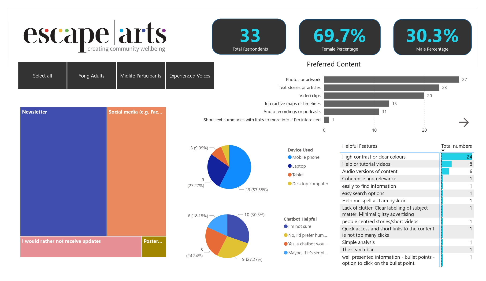
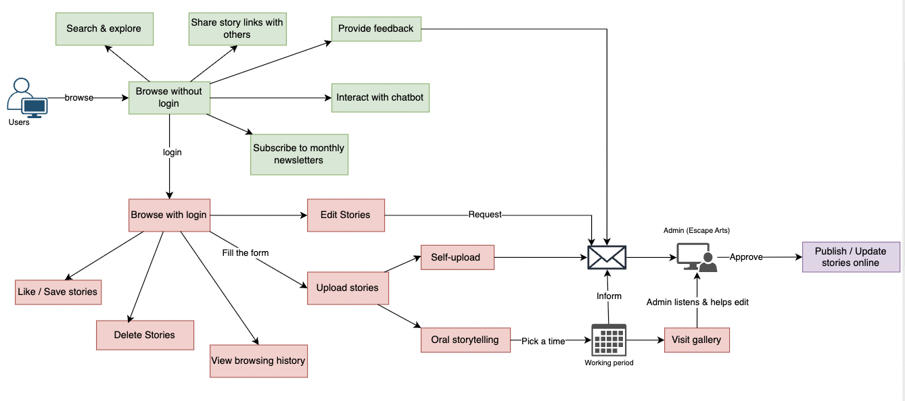
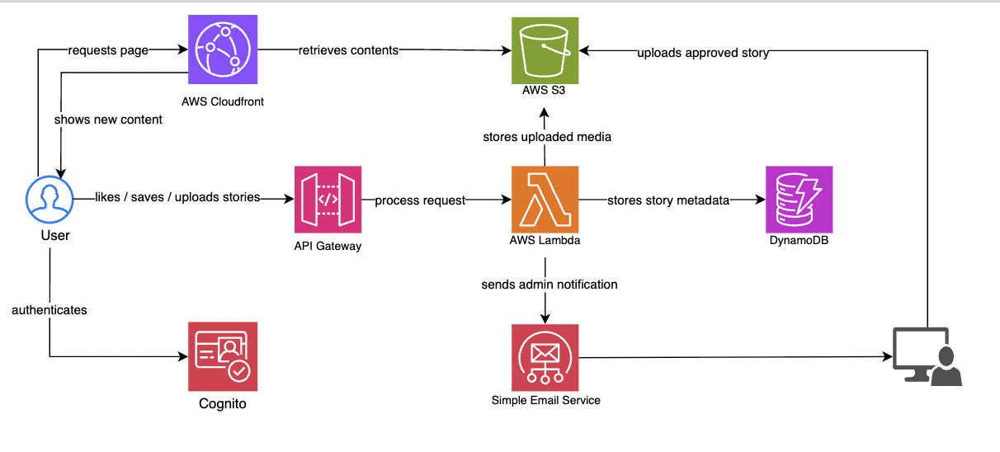

# 📂 The People’s Archive – Community Insights

This project was part of the **Escape Arts community initiative**, aiming to design an **accessible and inclusive digital archive** for the Stratford-upon-Avon community.  

As a **Data Analyst Intern**, I contributed to every stage of the process:  

<ul>
  <li>✅ <b>Designed and analysed</b> a user survey to explore browsing habits, accessibility needs, and content preferences.</li>
  <li>✅ <b>Cleaned and transformed</b> raw survey data for reporting and visualisation.</li>
  <li>✅ <b>Created interactive Power BI dashboards</b> to present insights clearly to stakeholders.</li>
  <li>✅ <b>Summarised findings</b> in both short and full reports for different audiences.</li>
  <li>✅ <b>Mapped user & admin workflows</b> to guide the archive’s design.</li>
  <li>✅ <b>Proposed an AWS cloud architecture</b> for secure, scalable content management.</li>
</ul>

This project strengthened my <b>data analytics, visualisation, and system design skills</b>, while contributing to a <b>real-world accessibility challenge</b> that affects diverse community members.

---

## 📊 Project Insights

We collected <b>33 survey responses</b> across different age groups:  

- <b>Young Adults (18–29):</b> 6%  
- <b>Midlife Participants (30–59):</b> 39%  
- <b>Experienced Voices (60+):</b> 55%  

### 🔑 Key Findings

<ul>
  <li>👥 <b>Older participants (60+)</b> were the most engaged contributors, while younger audiences preferred flexibility and mobile-friendly access.</li>
  <li>🖼️ <b>Photos, artwork, and short text stories</b> were the most popular content types.</li>
  <li>🎨 <b>High-contrast, simple layouts</b> were critical for accessibility, especially for older users.</li>
  <li>📝 <b>Self-uploading stories</b> was the most preferred contribution method, with workshops as a valuable secondary option.</li>
  <li>📧 <b>Newsletters</b> were the preferred update method, followed by social media.</li>
</ul>

---

## 🌐 Web Features & Accessibility Dashboard

  
Figure: Content types, accessibility needs, and update preferences across different age groups.

## 📈 User Engagement Dashboard

  
Figure: Preferred contribution methods, comfort factors, and willingness to engage with the archive.

## 🔄 User & Admin Workflow

  
Figure: Workflow for guest users, registered users, and admin approval processes.

## 🏗️ AWS Cloud Architecture

  
Figure: Proposed AWS cloud setup for scalable hosting, authentication, and secure workflows.

## ✅ Recommendations

<ul>
  <li>Prioritise <b>visual and text-based content</b>, especially <b>local stories and artwork</b>.</li>
  <li>Implement <b>high-contrast, mobile-friendly designs</b> to support older audiences.</li>
  <li>Use <b>newsletters as the main update channel</b>, with social media as secondary.</li>
  <li>Keep chatbots optional—<b>older users prefer human help</b>, while younger users are more open.</li>
  <li>Offer <b>self-uploading as the primary contribution method</b>, but provide <b>workshops and assisted uploads</b> for less tech-confident participants.</li>
</ul>

---

## 🛠️ Tools & Technologies

- **Power BI** – dashboard creation & visualisation  
- **Python (Pandas)** – data cleaning and transformation  
- **AWS (S3, Lambda, DynamoDB, CloudFront, Cognito)** – proposed cloud architecture  
- **draw.io** – workflow diagrams  

---

## 👩‍💻 Author

**Alicia Zhao**  
*Data Analyst Intern at Escape Arts*  

This project gave me the opportunity to **apply my data analysis skills to a real-world community initiative**, creating actionable insights that improve accessibility and engagement.
